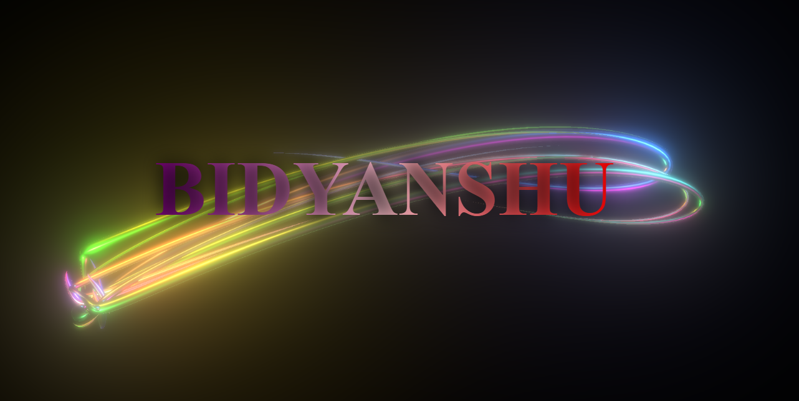

# 🎨 Tubes Animation (Generative Canvas Art)

A visually stunning generative art animation built using HTML, CSS, and JavaScript.
This project uses the HTML Canvas API to create smooth, colorful moving lines (tubes) with dynamic motion and effects.

---

## 🚀 Features

* 🎨 Canvas-based generative animation
* 🌈 Dynamic colorful tube effects
* ⚡ Smooth real-time motion
* 📱 Responsive full-screen canvas
* 🔄 Continuous animation loop
* 🧠 Math-based movement (trigonometry)

---

## 🛠️ Tech Stack

* HTML5
* CSS3
* JavaScript (Vanilla JS + Canvas API)

---

## 📁 Project Structure

```id="tube123"
tubes-animation/
│
├── index.html
├── style.css
├── script.js
└── assets/
```

---

## 🎯 How It Works

* Multiple points are generated randomly on the canvas
* Each point moves in a dynamic direction using math functions
* Lines are drawn between previous and current positions
* Creates a smooth "tube-like" animation effect

---

## 📦 Setup & Run

### 1️⃣ Clone the repository

```id="clone111"
git clone https://github.com/bidyanshu-20/TUBER_ANIMATION_WORK.git
cd tubes-animation
```

---

### 2️⃣ Run the project

बस `index.html` open karo browser me ✅

---

## 📸 Screenshot



---

## 🌐 Deployment (Coming Soon)

```id="deploy111"
Live Demo: https://your-tubes-project-link
```

---

## 🔮 Future Improvements

* Add color customization 🎨
* Add speed control 🎛️
* Add user interaction (mouse effects)
* Add different animation modes

---

## 👨‍💻 Author

**Bidyanshu Kumar**

---

## ⭐ Support

If you like this project, please ⭐ the repository!
